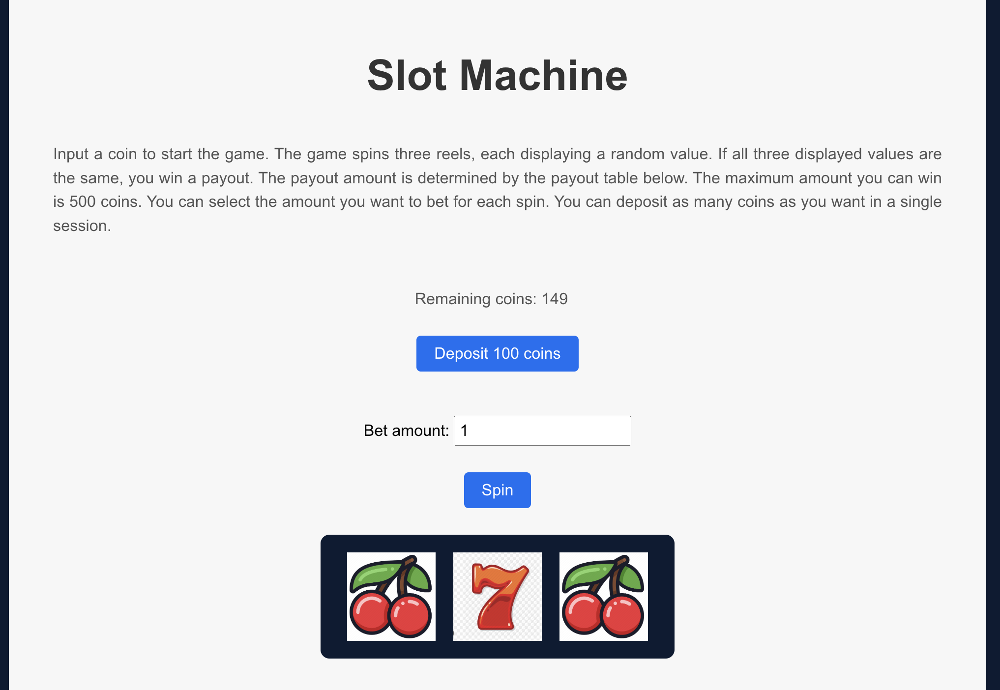

# Slot Machine App

A modern and colorful casino-themed slot machine app built with React. Users can deposit coins, adjust their bet, and spin the reels to win payouts based on different combinations.




## Table of Contents

- [Installation](#installation)
- [Usage](#usage)
- [Features](#features)
- [Contributing](#contributing)
- [License](#license)

## Installation

To set up and run the Slot Machine App on your local machine, follow these steps:

1. Clone the repository to your local machine:

```
git clone https://github.com/legertom/slot-machine.git
```

2. Navigate to the project directory:

```
cd slot-machine-app
```

3. Install the required dependencies:

```
npm install
```

4. Start the development server:
```
npm start
```

The app should now be running on `http://localhost:3000`.

## Usage

1. Start by depositing coins using the "Deposit 100 coins" button.
2. Adjust your bet amount using the input field.
3. Click the "Spin" button to spin the reels.
4. If you get a winning combination, you'll receive a payout according to the payout table.
5. You can view the instructions by clicking the "Instructions" button.

## Features

- Modern and colorful casino-themed user interface
- Customizable bet amount
- Deposit and manage coin balance during a session
- Spin the reels to win payouts based on different combinations
- Instructions modal for easy access to game rules

## Contributing

Contributions to the Slot Machine App are welcome! To contribute, follow these steps:

1. Fork the repository.
2. Create a new branch with a descriptive name: `git checkout -b your-feature-name`
3. Commit your changes: `git commit -m 'Add some feature'`
4. Push the branch: `git push origin your-feature-name`
5. Open a pull request with a clear and concise description of your changes.

## License

This project is licensed under the MIT License. See the [LICENSE](LICENSE) file for details.
